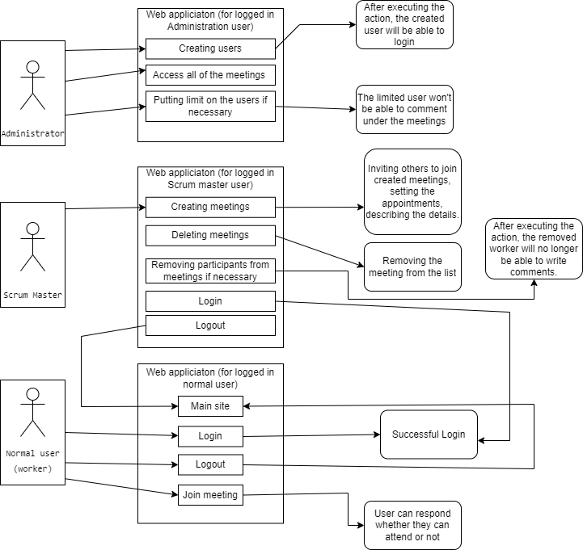

# Functional specification

## 1. Current situation

The buyer currently uses Google calendar system to organise the meetings, and to send out invitations to these. This poses some issue, mainly that not everyone uses the Google ecosystem, and they sometimes experience bugs and problems with these invites. Also, they have no authentic way to see who accepted the invitation, or if they've seen the invitation at all. Besides of these, the meeting organizer has to find all the participant's email addresses, and type them in one by one. This takes a long time to do every day.

## 2. Objectives

The project goal is a website/web application, which is a compact team management application package for the client. The system was available in web browser and mobile web browser. During the registration, the user may decide what role to play in the team. The application is designed to be clean and simple for easy usage. The system provides an opportunity to make online scrum meetings and synchronized plan calendar with the team. In another tab, the site or submenu has a task tracker just like Trello, and progress monitoring with different circumstances. Only the team leader can add or remove team members in the application.

## 3. Current business processes

Nowadays there are few capable websites or web applications for team management and team organization. Company's search or trying to develop team managing application/service for them have overview our teams. Some teams use multiple applications or trial versions of services, but it's not a long-lasting option. Some members of the team hate switching applications or services. Our team goal is to collect these services and application good benefits to one web application.

## 4. Requested business processes

## 5. Request list

| Id | Module | Name | Description |
| :---: | --- | --- | --- |
| R1 | Access | Login screen | Login form page |
| R2 | Access | Registration | Registration form page |
| R3 | Access | Access Levels | - Normal user  - Srum master  - Administrator |
| R4 | Modification | User modify | Change username |
| R5 | Modification | Password modify | Change password |
| R6 | Modification | Email modify | Change email |
| R7 | Modification | Forgot your username or password | In case of forgetting your username or password, you can fill in a form. After filling it in, an automated email will be sent. |
| R8 | Interface | Calendar | Adding events. |
| R9 | Interface | Online meeting | The "Team"/"Group" holds meetings. |
| R10 | Interface | Task list | List for tasks. |
| R11 | Interface | Progression | Page for tracking progression. |
| R12 | Interface | Login | Users can log in here to the application. |
| R13 | Interface | Messages | Page for incoming messages. |

## 6. Use Cases

### Administrator

 + The administrator can use all functions in the application, to check trouble-proof operation of the system. They have access to the user list, to moderate and manage them. They can send message to each users and global message to everyone, which they get at the same time.

### Scrum master

 + The Scrum master after the registration has a unique interface, where he/she creates and manages our teams/groups. They only can send messages or group messages to users, in our team/group. The project tab (work place) shares the same interface by users, but he/she has more options. The calendar can only be edited by the scrum master.

### Normal user (Worker)

 + They have the fewest options, just enough to get the job done. Users only see the teams they are in. And a more simplified interface than the other role, because of easier usage.

## 7. Compliances

| ID | Complliances | References |
| --- | --- | --- |
| C1 | User administration | [K1, K2, K4, K5, K6, K7, K12](#5-request-list) and Logout |
| C2 | Meeting organisation | [K8, K9](#5-request-list), Scrum master can manage the meetings, and users only join or decline the invitation |
| C3 | Calendar | [K8, K10](#5-request-list), Selected event give a pop-up tab with more information |
| C4 | Message system | [K13](#5-request-list), Users get message from the system and other users independently from roles([K3](#5-request-list)) |

## 8. Screen plan

### Sign Up

### Sign In

### My profile

### My meetings (calendar view)

### My meetings (list view)

### Meeting invites

### Manage meetings (in scrum master's point of view)

### Manage meetings (in admin's point of view)

### Meeting page

### Users

### Create team

### Manage teams

### Meeting reminder email

### Invite received

### Create meeting

## 9. Scenarios

### Online meeting:

 + The scrum master creates the meeting and sets the date, when it start and on which day. After this set up, the system puts the date in the participants calendar.
 + The participants can respond to the scrum master whether they can or can't participate.

### Calendar:

 + Users can keep track of their events or deadlines.
 + Near one of the events or deadlines, the user will receive a notification e-mail.

### Teams:

 + The scrum master can create Teams.
 + Users can only join a team if they have a invitation.
 + The scrum master can invite a whole team to the meeting.

## 10. Functionality

| Id | Requirement | Functionality |
| :---: | --- | --- |
| I1 | R1 | FR1 |
| I2 | R1 | FR2 |
| I3 | R1 | FR3 |
| I4 | R2 | FR4 |
| I5 | R2 | FR5 |
| I6 | R2 | FR6 |
| I7 | R1 | FR1 |
| I8 | R1 | FR2 |
| I9 | R1 | FR3 |
| I10 | R2 | FR4 |
| I11 | R2 | FR5 |
| I12 | R2 | FR6 |
| I13 | R3 | FR20 |
| I14 | R4 | FR14 |
| I15 | R5 | FR14 |
| I16 | R6 | FR14 |
| I17 | R4 | FR15 |
| I18 | R5 | FR15 |
| I19 | R6 | FR15 |
| I20 | R4 | FR16 |
| I21 | R5 | FR16 |
| I22 | R6 | FR16 |
| I23 | R8 | FR17 |
| I24 | R8 | FR18 |
| I25 | R8 | FR19 |
| I26 | R9 | FR7 |
| I27 | R9 | FR8 |
| I28 | R9 | FR9 |
| I29 | R9 | FR10 |
| I30 | R9 | FR11 |
| I31 | R10 | FR12 |

## 11. Glossary

- Scrum meeting: A certain type of meeting where participants only discuss their thoughts in 15 minutes or less.  
Main gist of the meeting is about the following 3 questions:
  - What did you do yesterday?
  - What will you do today?
  - Are there any impediments in your way?
- Scrum master: Person responsible for arranging meetings, presenting advices for the development team and remedying the impediments.
- Task tracker: It's a single place or an application where you and your team can organize and prioritize every single task or item that needs to get done.
