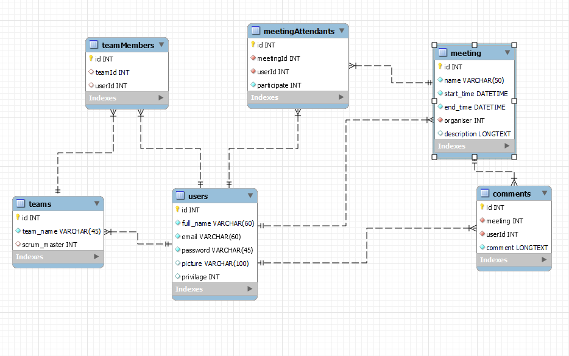

# System Specifications

## 1. Goal of the System

The purpose of the system lies within creating and editing scrum meetings, albeit it doesn't despise tracking them as well.  
We might attempt to ease the hardships of scrum masters related to arranging scrum meetings for the other members of a development team.  
According to our schemes, this project is gonna be a dynamic web application written in PHP programming language using Laravel framework alongside with a database system of free choice.

## 2. Project Plan

### 2.1 Project Roles

   * Scrum masters: Nándor Banyik
   * Product owner: Nándor Banyik
   * Business participant: Nándor Banyik
     
### 2.2 Project Staff:

   * Frontend: Balázs Karácsony, József Imre Tabajdi
   * Backend: Tamás Györkis, Gergő Tamás Birinyi
   * Testing: Balázs Karácsony, Tamás Györkis, Gergő Tamás Birinyi, József Imre Tabajdi
     
### 2.3 Schedule:

| Function | Task | Priority | Estimation (in days) | Actual estimation (in days) | Time elapsed (in days) | Estimated time (in days) |
|-------------------------|----------------------------------------|-----------|---------------|------------------------|------------------|---------------------|
| Requirement Specification | Ellaboration | 1 | 3 | 3 | 2 | 3 |             
| Functional Specification | Ellaboration | 1 | 3 | 2 | 3 | 2 |
| System Specification | Ellaboration | 1 | 2 | 3 | 3 | 3 |
| Application | Creating Screenplans | 2 | 3 | 3 | - | 2 |
| Application | Creating the Basic Functionality | 3 | 8 | 8 | - | 8 |
| Application | Creating Prototype | 3 | 8 | 8 | - | 8 |
| Application | Testing | 4 | 2 | 2 | - | 2 |

### 2.4 Milestones:

   * writing of Requirement Specification
   * writing of Functional Specification
   * writing of System Specification
   * designing screenplans
   * demonstration of screenplans
   * preparation of the base app skeleton by Laravel framework
   * starting to code the basic functions
   * completion of basic functionalities
   * conveyance of Prototype
   * fixing errors of Prototype (if there are any)

## 3. Model of Business Processes

### 3.1 Business Participants

   * Normal User (A.K.A. User)
   * Scrum Master
   * Administrator

### 3.2 Business Processes

   - __Basic capabilities:__
     - Creating account with properly given credentials (**Sign Up**), such as Email, Full Name and Password
     - Being able to select the account type (*Normal User* or *Scrum Master*) in the process of Sign Up
     - Logging into an existing account (**Sign In**) with Email and Password
     - Logging out of an account (**Sign Out**)
     - Having a 'Full Name' for simple identification for other users
     - Being able to check the details of your profile
     - Changing password or other user credentials
     - Other means of uploading data to database

   - __Normal User:__
     - Being able to check their upcoming meetings in a calendar-like view
     - Opportunity to book meetings in their calendar
     - Leaving a comment on designated section of a specific meeting
     - Chatting to other members of a specific meeting  

   - __Scrum Master:__
     - Creating meetings, determining their appointments
     - Deleting meetings created by them
     - Inviting others to join created meetings
     - Removing participants from meetings if necessary
     - Being able to take their part in conversations on message boards of meetings as well

   - __Administrator:__
     - Putting a limit on users', whose behaviour is beyond appropiate, access to certain parts of the app (e.g. writing comments) along with notifying HR about the case
     - Being able to access all of the meetings on the website
     - Creating user accounts  

## 4. Requirements

### Functional Requirements

| ID | Name | Description |
| --- | --- | --- |
| R1 | ... | ... |

### Non-Functional Requirements

| ID | Name | Description |
| --- | --- | --- |
| R4 | ... | ... |

### Supported Devices

## 5. Plan of Functionality

### 5.1 System Participants

### 5.2 Menu hierachies

## 6. Physical Environment

### Purchased Softwarecomponents and other Third Party Softwares

### Hardware Topology

### Physical Subsystems

### Development Tools

## 8. Architectural Plan

### Webserver

### Database System

### Accessibility of the Program, Ease of Use

## 9. Database Plan

## 10. Plan of Implementation

## 11. Testing Plan

We plan to utilize automatic UI testing. This allows us the periodically test the user interface after each change. This will be done using Cypress, which is an open-source tool designed to test front end web applications.

Every week, the team gathers to check that all task done during the previous week is up to standard and it is completed.

### Test Cases

Below you can see some **example** test cases:

Test No. | Short Description | Expected Result | Actual Result | Note
----------|--------------|---------------|----------|-----------
No.1 | Sign Up | User is successfully able to sign up with given credentials  | Succesful registration | There were no problems found.
No. 2 | Login | The user is able to login with correct credentials. | Successful login | No problems found
| No. 3 | Create team | A team can be created and people can be added to it by a scrum master | The team is created, the users are added. | No problems found
| No. 4 | Create meeting | A meeting is created and user can be invited to it. | The creation happens and the people are invited. | No problems found.

## 12. Installation Plan

Physical Installation Plan: 

Our software requires a server to work. The server must be connected to a network so it can be reached, preferably with a gigabit ethernet LAN port. The server components depends on the number of people that's going to use our product.

Software Installation Plan:

- Our software can run on Windows Server or any other Unix-based operating system.
- It requires a software capapble of serving websites to customers (e.g.: IIS, Apache, nginx)
- A databse server must also be configured and made available (e.g.: MySQL server (recommended), PostgreSQL, Oracle SQL, etc.)
- The website must be uploaded to the webserver.
- In the main folder, a '.env' file must be created and configured with at least the following settings:
  - The username, password, address and database name of the database server.
  - The mail provider settings.
  - The app name and url
- The application composer is also required to be installed
- "The composer install" command must be run before first using the application, so the necessary components can be installed and updated.
- After these, the "php artisan migrate --seed" command should be executed, which will create the database and seed it with some basic information.
- Optional: set up a domain name to be used with the website.
- The application is ready to be used.

## 13. Maintenance Plan

- Feedbacks of users and buyer: All feedbacks must be reviewed carefully and if necessarry, changes made to the application.
- Updates
  - Laravel updates checked every 6 months.
  - Composer packages updated every 2-3 months
- Bugs: all reported and discovered bugs must be fixed as soon as possible. The bugs must be tracked on the Github repository.
- New features: all new required features during the life cycle of the software must be discussed with the team, implemented and tested.